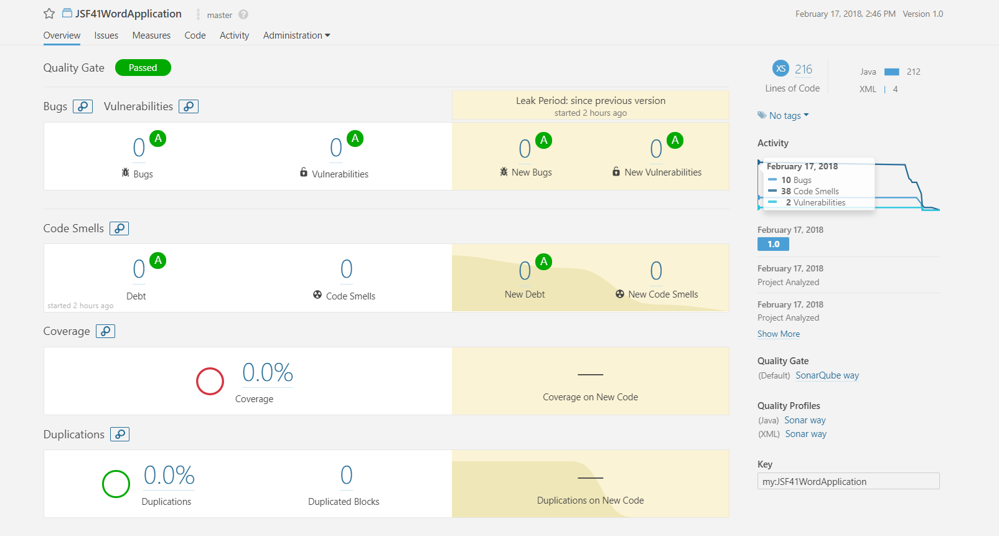

# Word application Martijn
This application is the execution of Assignment 1.  
There are several use cases of this application:
- Count the total amount of words of text
- Count the amount of different words in text
- Sort the words in reverse alphabetical order
- Count how many times a word exists in the text sorted by frequency
- Create a concordance of the words in the text

# Non-functional requirements
The application has the following non-functional requirements:
- Use the Facade pattern
- Avoid repetition in code by using methods
- Write functional tests for the example text
- Estimate the complexity of every operation
- Write a performance test for 10 000 and 1 000 000 words.  
What is the execution time per test?

# SonarQube
I used SonarQube to squash the pesky bugs left-over after checking the code myself.  
It gave me some interesting insights in the order of the 'static' and 'final' keywords and reminded me of using a Logger instead of System prints.  
The results can be seen in the image below:  

# Running this application
You can get started with this application by simply cloning it and running the WordApplication class in your favorite IDE.